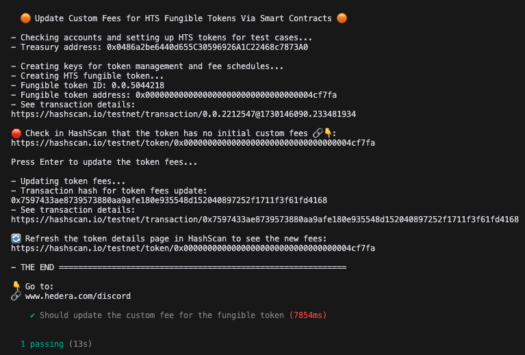
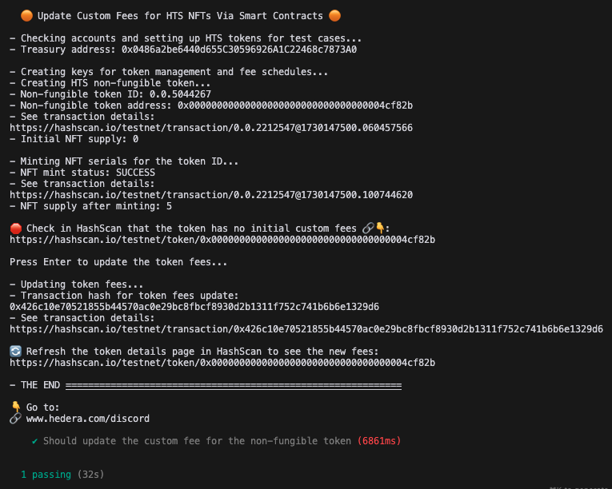

# Update Custom Fees for HTS Tokens via Contract (HIP-1010 Reference Implementation)

This repository shows how to update custom fees for HTS tokens (fungible and NFT) via a smart contracts, which is enabled by [HIP-1010](https://hips.hedera.com/hip/hip-1010). The example demonstrates how to interact with HTS precompiles using standard Solidity interfaces, enabling developers to work with Hedera tokens using familiar ERC-like patterns.

## Try It in Gitpod

[](https://gitpod.io/?autostart=true#https://github.com/ed-marquez/hedera-example-update-token-fees-via-contract-hip-1010)

1. Enter your Hedera testnet credentials in the `.env` file
2. Run tests for fungible tokens, NFTs, or both:

| Fungible Token                                                          | NFT                                                       |
| ----------------------------------------------------------------------- | --------------------------------------------------------- |
| `npx hardhat test ./test/updateFungibleTokenFeeViaContract.test.js`     | `npx hardhat test ./test/updateNftFeeViaContract.test.js` |
|  |          |

## Local Setup

1. Clone the repository
   ```bash
   git clone https://github.com/ed-marquez/hedera-example-update-token-fees-via-contract-hip-1010.git
   ```
2. Copy `.env.sample` to `.env` and add your environment variables (and Hedera testnet credentials)
   ```bash
   cp .env.sample .env
   ```
3. Install dependencies
   ```bash
   npm install
   ```
4. Run tests for fungible tokens, NFTs, or both:

   ```bash
   npx hardhat test ./test/updateFungibleTokenFeeViaContract.test.js
   ```

   ```bash
   npx hardhat test ./test/updateNftFeeViaContract.test.js
   ```

5. Follow the instructions in the terminal

## Key Files

- `.env`: Account credentials and environment variables
- `hardhat.config.js`: Hardhat configuration including network settings and compiler options
- `constants.js`: Network configurations and default values
- `utils/tokenOperations.js`: Functions for creating and managing HTS tokens
- `utils/contractInterfaces.js`: ABI interfaces for HTS precompile interactions
- `test/`: Test files demonstrating HTS precompile usage patterns
